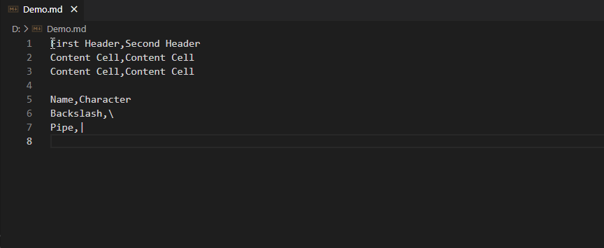
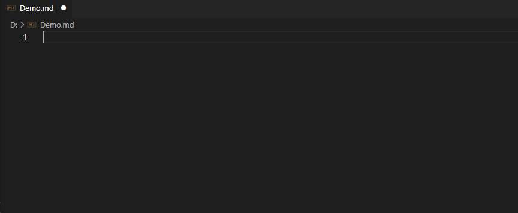
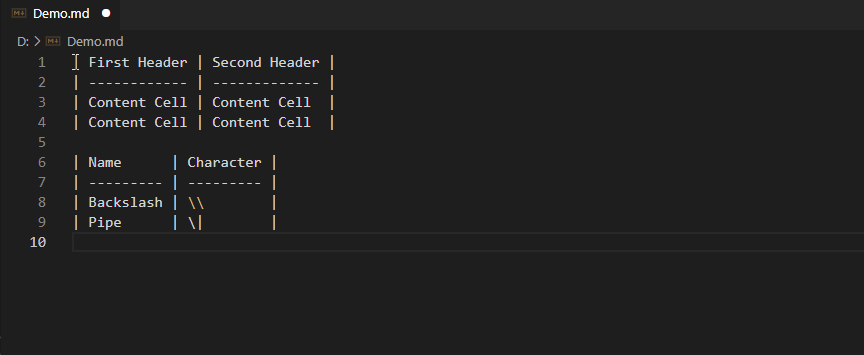

# CSV to Markdown Table

Convert CSV/TSV/PSV text to GitHub Flavored Markdown table.

## Features

- Auto-detect text type
    - CSV: Comma-separated (or Semicolon-separated) values text
    - TSV: Tab-separated values text
    - PSV: Pipe-separated values text
- GitHub Flavored Markdown table formatting
    - Table formatting supports CJK (Chinese/Japanese/Korean) characters
- Multi selection support
    - See below a [demo](#usage)
- Paste as Markdown table from the clipboard
    - See below a [demo](#usage)
- Convert Markdown table to CSV
    - See below a [demo](#usage)

## Installation

To install this extension go to `View->Extensions` and search for `csv-to-md-table`. Next click Install and then Reload.

## Usage

To use the extension go to the Command Palette (`Cmd+Shift+P` on macOS or `Ctrl+Shift+P` on Windows) and launch `Convert CSV to Markdown table` command.

You can paste as Markdown table from the clipboard by launch with `Paste CSV as Markdown table` command on the Command Palette.

And you can convert Markdown table to CSV by launch with `Convert Markdown table to CSV` command on the Command Palette.
> This command use `, (comma)` delimiter by default.  
> **Use `Convert Markdown table to CSV with Delimiter...` command, if you want to use other delimiter.**

## Settings

Currently, there is no settings.

## Issues

If you find any problems using this extension or you want to propose new features to it, feel free to open an issue on [Github](https://github.com/phoihos/vscode-csv-to-md-table/issues).

## Release Notes

Detailed Release Notes are available [here](https://github.com/phoihos/vscode-csv-to-md-table/blob/master/CHANGELOG.md) or above **Changelog** tab.

## Attributions

Icon made by [Smashicons](https://www.flaticon.com/authors/smashicons) from [www.flaticon.com](https://www.flaticon.com/)
